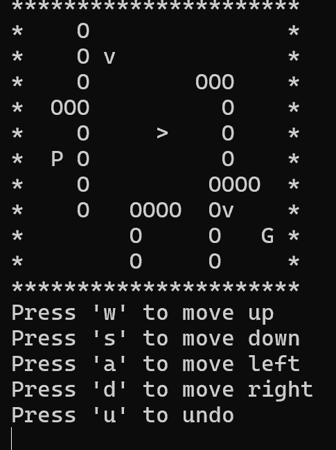

# maze-game
A little CLI maze game made in C.

Simply run `make`, then `./escape <map>`. A default `map.txt` is provided, but any map file that conforms to the following will do:
- 0 represents ’ ’ (An empty space)
- 1 represents ’P’ (The Player)
- 2 represents ’G’ (The Goal)
- 3 represents ’O’ (The Walls)
- 4 represents enemy (Direction is randomised)

